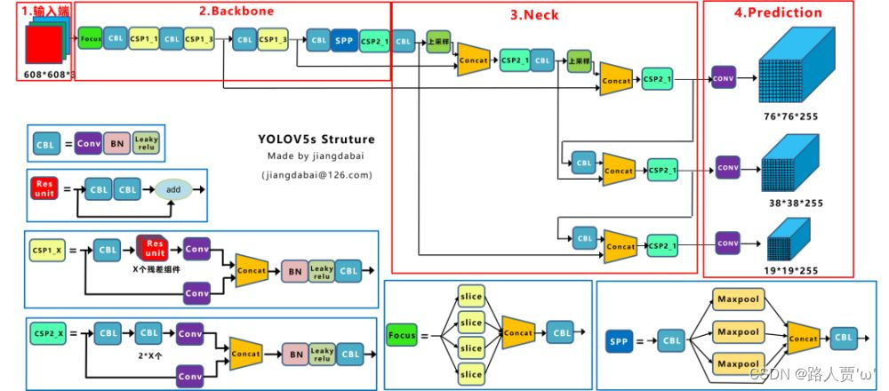
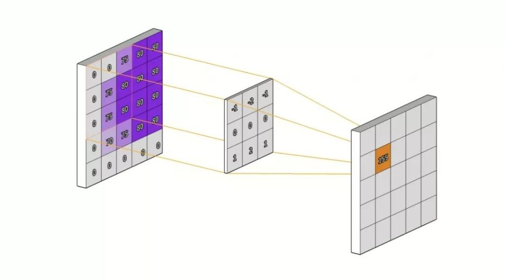
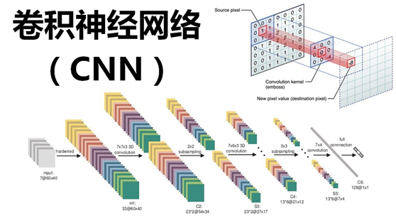
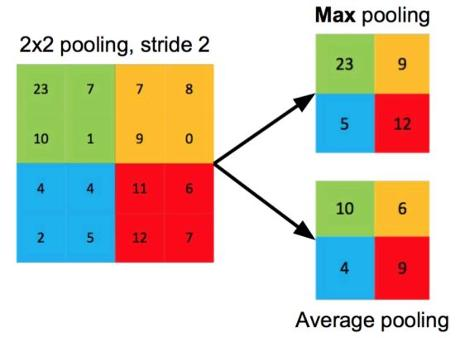

<h1 align = "center"> 关于 yolo-v5 本地模型部署训练的分析报告 </h1>

<h4 align = "center" > 模型训练：黄泊凯   报告撰写：何健聪 </h4>

> **前言**:
> 研究项目： **yolov5** 卷积视觉识别模型。
> 在本次合作中，了解如何使用与训练模型，并尽可能理解模型原理，初步建立起神经网络专业知识体系。  

### 一、学习思路  

>总体路线方向为**任务驱动型**：有什么，为什么，是什么  

1. 使用与训练模型：在使用训练的过程中，体会神经网络的各个特性及其作用效果，建立直观的印象感觉.
2. 分析并学习原理：分析过程中记录的各种现象效果，学习神经网络的相关概念原理，实现对神经网络相关概念原理的理解应用，初步建立系统概念体系。  

### 二、环境配置

~~~
编程语言：
    python3 (3.11)  
运行环境：
    [ OS -- Windows10 ] 
    [ Anaconda3 ]
    [ Pytorch -- CPU version ]
编译软件：
    Pycharm (JetBrains)
~~~

### 三、模型选择 / 需求分析  

#### 模型选择  

由 Ultralytics 研发的基于 YOLO 算法的卷积视觉识别模型 yolo-v5

#### 项目需求

##### 搭档  

1. **系统设计**：低成本且方便快速部署的仓库监测管理系统  

2. **应用对象**：配套设施相对缺乏、管理人员不足的中小型仓库

3. **核心模块**：设计一种能适应多种地形的无人车,搭载有诸如 **K210** 或者 **Raspberry-Pi** (RPi 树莓派) 等带有 **KPU**（卷积人工神经网络硬件加速器）的 **MCU** (Microcontroller Unit)  

4. **实现目的**：通过训练并在无人车 MCU 上部署端侧模型，可以实现无人车可以按要求对仓库相应区域进行巡检检测并在发现意外突发情况及时告警。

5. **需求问题**：无人车上搭载的 MCU 在定位和性能上属于**边缘计算**设备,在算力支持方面比较欠缺，特别运算能力的分配捉襟见肘

6. **解决方案**：端侧模型模型的训练部署过程中对模型的大小和算力需求有限制，综合考虑了模型性能和平台算力，最终选择了 **yolo-v5** 模型。同时权重参数方面选择最小神经网络参数文件 ( yolov5s -> yolov5-small )

##### 我的

i. 实验室无人机项目中提供一个视觉识别的解决方案，最终和搭档商讨选择了这个模型。

### 四、模型原理

#### 卷积神经网络基本结构 ( CNN -> Convolutional Neural Network )

~~~
卷积层

作用：负责提取输入数据的局部特征
    不同层次维度：基础几何特征 -> 对象部件类别高级抽象特征）

操作流程： 

1.权重初始化            
    每个卷积层都有一组可学习的参数，通常被称为卷积核权重矩阵）。这些卷积核在网络开始
    训练时会随机初始化。
2.滑动窗口              
    卷积核会在输入数据上以一定的步长进行滑动。每次滑动后，卷积核与输入数据相乘并求和,
    得到的结果就是一次卷积操作的输出。
3.激活函数（激活层）      
    卷积操作完成后，通常会应用一个非线性激活函数（如ReLU函数）来增强网络的表达能力和
    非线性特性。
4.偏置项处理   
    为了使卷积层的输出更加灵活，通常还会添加一个偏置项。
5.输出尺寸计算           
    卷积层的输出尺寸取决于输入尺寸、卷积核大小、步长以及是否使用了填充技术.
~~~

~~~
激活层（激活函数） 

作用：对卷积层的输出进行非线性变换，以增强模型的非线性特性和学习能力

以 yolo-v5 为例：

    ReLU function ：
        线性整流单元 (Rectified Linear Unit)
        工作原理：  
        对于输入的每个元素，如果该元素大于0，则保持不变,如果小于等于0，则将其设置为0  
        ReLU函数能够解决梯度消失的问题，并且可以加快网络的训练速度,此外，ReLU函数
        还可以自动地进行特征选择，丢弃那些不重要的特征。  

    Leaky-ReLU function：
        Leaky ReLU 函数是 ReLU 函数的一个改进版本,在输入小于0时不会停止传播梯度，
        而是有一个小的负梯度,这样可以防止梯度消失，并允许模型学习到更多的非线性关系  
~~~
~~~
池化层（非线性操作层）

作用：用于减少数据尺寸维度，以降低模型计算复杂度（提高训练速度）和防止过拟合  

处理模式：最大值池化 (Max Pooling) OR 平均值池化 (Average Pooling)

处理过程：对输入的数据进行局部区域的池化处理，并将其作为新的特征,重复这个操作，直到
         覆盖所有的局部区域。
~~~

~~~
全连接层

作用：将前面卷积层和池化层提取出的特征进行整合，并进行分类或者回归任务（应用）

补充：批归一化层 ( BN -> Batch Normalization )
     严格意义上讲，这并不是一种层次结构，只是一种技术操作对网络中间层的输出进行规范化
     处理，以减小不同批次数据之间的差异，加快训练速度，并提高模型的泛化能力
~~~

~~~
    模型结构  
        Input               输入端  
        Backbone            核心神经网络（骨干部分）  
        Neck                特征融合处理（样本特征自适应）  
        Head / Prediction   预测输出  

        || -> 每个模块均包含有多种层

    模型组件  
        名称                 所属层级  
        Mosaic               Input  
        Focus                Backbone  
        CSP-1                Backbone  
        SPP                  Backbone  
        CSP-2                Neck  
        CBL                  Global  
        Conv                 Global  

    Mosaic -- 数据增强算法（输入端）  
        该算法将多张图片按照一定比例组合成一张图片，使模型在更小的范围内识别目标，
        该算法参考了 Cutmix 算法

    Focus  -- 数据处理（卷积神经骨干网络层）
        对图片进行切片操作 -> 具体来讲是在一张图中每隔一个像素取一个值

    CSP ( CSP-1 / CSP-2 ) 

    SPP -- 特征图处理
        用于不同尺寸的特征图如何进入全连接层的，在网络的最后一层concat所有特征图，
        后面能够继续接CNN模块 

    NMS (Non-Maximum Suppression) -- 特征结果处理算法
        当模型输出多个重叠的检测框时，NMS算法通过计算检测框之间的交并比(IOU)来
        抑制多余的检测框，仅保留得分最高的一个。以去除重复结果，提高检测的准确性
        和效率。

        i.  DIOU-NMS
            中心点较远 -> 不同物体（保留）

        ii. SOFT-NMS
            对于重合度较大的检测框不是直接剔除，而是施加惩罚（降低分数）

    CIOU-Loss -- 损失函数（预测层）
        衡量模型预测值与真实值之间的差异程度

~~~

### 五、模型训练  

数据集

模型运行结果范例

### 六、成果展示

> 结语  
> 感谢在这个过程中给予到帮助和支持的师长：  
> 神经网络与机器学习选修课 孟献兵老师  
> python零基础选修课 吴颖老师  
> 工大创谷华为昇腾创享社-小A工作室：  
>> AI组 罗琨师兄  
>> AI组 唐磊师兄  
>> 电控组 朱玉施师兄  
>> 电控组 郑梓扬师兄  
>
